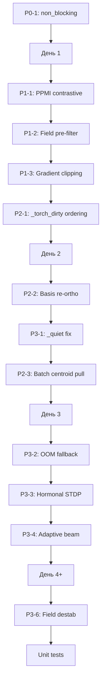

# Анализ архитектурного отчёта — выводы и решения

## 1. Что уже исправлено (из предыдущей сессии)

| ID | Проблема | Статус | Где |
|----|----------|--------|-----|
| P0 (5.5) | concept_freq сохраняется как int32 | ✅ `np.float32` | `syntax_lattice.py:444` |
| P1 (S-1) | field_weight без верхней границы | ✅ `min(..., 3.0)` | `crystal_generator.py:1039` |
| P1 (3.1) | _vecs_t stale после STDP | ✅ хук `_after_update_hook` синхронизирует после каждого `_apply_vector_update` | `concept_space.py:529-531`, `crystal_generator.py:87-89` |
| P1 (A-1) | Циркулярная зависимость CS↔CG | ✅ через callback, без внедрения CS в CG | `concept_space.py` + `crystal_generator.py` |
| P2 (A-3) | Нет абстракции генерации | ✅ `@dataclass GenerationResult` + обновлены все потребители | `crystal_generator.py:44-54` |
| P2 (5.3) | total_freq O(V) на каждую строку | ✅ кэш с автоинвалидацией при `lattice.update/decay_all` | `crystal_generator.py:_get_total_freq()` |
| P2 (4.1) | Curriculum — жёсткие пороги по эпохам | ✅ непрерывный ramp (max_len, context_window, neg_samples, pmi_gate_min) | `train_full.py` |
| P3 (5.4) | concept_error FIFO — неэффективна | ✅ `OrderedDict` + `popitem(last=False)` | `crystal_generator.py` |
| P3 (S-5) | Нет field_bits fallback в дестабилизации | ❌ **не исправлено** | — |
| P3 (3.2) | _fb_t не обновляется | ❌ **не исправлено** | — |

## 2. Что НЕ исправлено — требует решения

### Приоритет P0 (критические)

#### P0-1: non_blocking=True + pin_memory не используются

**Где:** `_gpu_stdp_apply` и `_ensure_torch` — все тензоры создаются через `torch.tensor(...).to(device)` без `non_blocking`.

**Почему важно:** Блокирующие передачи CPU→GPU синхронизируют поток CUDA, снижая пропускную способность на ~5-10%. При 146K векторах × 384D = 224MB пересылаемых при каждом `_ensure_torch`, ускорение будет заметным.

**Решение:** добавить `non_blocking=True` во все `.to(device)` вызовы, использовать `pin_memory=True` для CPU-тензоров, которые будут многократно пересылаться (например, `_vecs_t` initial copy).

**Сложность:** 30 мин. Файлы: `crystal_generator.py` — `_gpu_stdp_apply`, `_ensure_torch`, `evaluate`.

---

### Приоритет P1 (высокие)

#### P1-1: Uniform random в contrastive objective (S-2)

**Где:** `_contrastive_objective()` — `cs.rng.randint(0, cs.vocab_size, size=80)` из 146K. Вероятность найти hard negative (cos > 0.05) крайне мала.

**Почему важно:** Текущий подход тратит compute впустую — большинство итераций находит только «лёгкие» негативы (cos ≈ 0), которые не дают полезного push. Это прямой путь к замедленной сходимости.

**Решение:**
- Использовать PPMI-ранжирование: взять top-100 по cosine similarity к gen_cid, отфильтровать имеющие PMI-связь > порога, оставить hard negatives (cos > 0.05)
- Альтернатива: взять bottom-50 по PPMI (отрицательная PMI = взаимоисключающие концепты)

**Сложность:** 1-2 часа. Файлы: `crystal_generator.py:_contrastive_objective`.

#### P1-2: Field pre-filter в _branch() (6.5)

**Где:** `_branch()` — комбинирует graph, syntax, vector similarity, но не фильтрует кандидатов по field_bits.

**Почему важно:** При context_window=5 может быть >1000 кандидатов. Field pre-filter исключит семантически несовместимые (overlap=0), сократив пространство поиска и улучшив качество генерации.

**Решение:** перед RRF-комбинацией отфильтровать кандидатов с нулевым field overlap относительно контекста.

**Сложность:** 30 мин. Файлы: `crystal_generator.py:_branch`.

#### P1-3: Асимметрия CPU/GPU в lateral inhibition — градиентный клиппинг (3.5)

**Где:** Все обновления используют прямой `grad * base_lr_val` без клиппинга.

**Почему важно:** При destab_scale > 0 градиент может быть > 1.0, вызывая осцилляции. Без `max_grad_norm` невозможно гарантировать стабильность при высоких destab_scale.

**Решение:** добавить `max_grad_norm` в конфиг и применять `grad = grad / norm * max_grad_norm` при превышении.

**Сложность:** 15 мин.

---

### Приоритет P2 (средние)

#### P2-1: _torch_dirty ordering (4.3)

**Где:** `train_from_text()` и `train_batch()` — `_torch_dirty = True` установлен до вызова `_contrastive_objective()`.

**Почему важно:** Сейчас контрастив работает на CPU (numpy), но если кто-то добавит GPU-контрастив, `_torch_dirty = True` заставит `_ensure_torch()` сделать полный пересчёт, сбрасывая недавние градиентные обновления.

**Решение:** перенести `_torch_dirty = True` в самый конец методов, после всех операций, включая `_contrastive_objective`, `_centroid_pull` и `lattice.update`.

**Сложность:** 5 мин. Файлы: `crystal_generator.py:1146-1149`, `1227-1232`.

#### P2-2: Ре-ортогонализация базиса на чекпоинтах (6.3)

**Где:** `ConceptSpace` — базис ре-ортогонализуется только при `load()`.

**Почему важно:** В процессе обучения коды дрейфуют, базис теряет ортогональность, что снижает качество фрактального кодирования.

**Решение:** добавить `check_basis_health()` в checkpoint-код (`train_full.py`), вызывать после `fluctuate_fractal`.

**Сложность:** 30 мин. Файлы: `concept_space.py`, `train_full.py`.

#### P2-3: Пулл центроида по батчу, а не по строке (4.4)

**Где:** `_centroid_pull()` вызывается для каждой строки отдельно. При batch=32 это 32 вызова.

**Почему важно:** Лишние вызовы CPU. Для batch=32 и sentence=50 токенов — 32 перебора всех токенов и 32 центроид-пулла.

**Решение:** накопить обновления за весь batch/все строки и применить one-shot centroid pull для всех уникальных CIDs.

**Сложность:** 1 час.

---

### Приоритет P3 (низкие / опциональные)

#### P3-1: _quiet для критических операций (5.2)

**Где:** `train_full.py:_quiet` используется для `ConceptSpace.load` (фатальная ошибка) и `lattice.load` (фатальная ошибка).

**Почему важно:** `except Exception` перехватывает `SystemExit` и `KeyboardInterrupt`. Если при загрузке чекпоинта пользователь нажмёт Ctrl+C — исключение будет проглочено, программа продолжит с `cs=None`.

**Решение:** убрать `_quiet` для load-операций, использовать явный `try/except Exception` с `sys.exit(1)`.

**Сложность:** 15 мин.

#### P3-2: Мониторинг VRAM + OOM fallback (A-4)

**Где:** Нет измерения потребления GPU-памяти.

**Почему важно:** MX550 с 2GB VRAM — на грани: `_vecs_t` (224MB) + `_fb_t` (37MB) + временные тензоры при STDP (varying). Короткий всплеск → OOM → падение всего обучения.

**Решение:** логировать `torch.cuda.max_memory_allocated()` в `_ensure_torch`, добавить fallback на CPU при `RuntimeError: CUDA out of memory`.

**Сложность:** 1 час.

#### P3-3: Интеграция гормонов в STDP (6.4)

**Где:** Гормональная система влияет только на генерацию (temperature, beam_width).

**Почему важно:** Свяжет intrinsic motivation (ACh — новизна, DA — успех) с пластичностью: высокие ACh/DA → больше LR на удачных/новых парах.

**Решение:** в `_build_pairs_from_ids` добавить `ach_gate` и `da_gate` как множители LR.

**Сложность:** 2 часа (новый функционал).

#### P3-4: Adaptive beam width (6.1)

**Где:** `beam_width` фиксирован.

**Почему важно:** При высокой энтропии нужно больше лучей для покрытия вариантов, при низкой — достаточно 1-2. Экономия compute без потери качества.

**Решение:** вычислять энтропию распределения вероятностей на каждом шаге, масштабировать `beam_width`.

**Сложность:** 30 мин.

#### P3-5: Dynamic context windowing (6.2)

**Где:** `context_window` одинаков для всех позиций.

**Почему важно:** Для глаголов нужен широкий контекст (субъект-объект), для предлогов — узкий. Расширение окна для позиций с высокой prediction error (`concept_error`) улучшит обучение без увеличения compute.

**Решение:** использовать `concept_error[gen_cid]` для динамического расширения окна.

**Сложность:** 1 час.

#### P3-6: Дестабилизация через field_bits fallback (S-5)

**Где:** `_gpu_stdp_apply` и `_cpu_stdp_apply` — если `lattice.connections_of()` пуст, дестабилизация не срабатывает.

**Почему важно:** Редкие токены не имеют PPMI-связей → никогда не дестабилизируются → застревают в локальных минимумах.

**Решение:** при пустом PPMI выбрать случайный концепт с пересекающимся field_bits.

**Сложность:** 30 мин.

---

## 3. Рекомендуемый порядок действий

### Этап 1 (день 1) — P0 + P1 критические
1. **P0-1: non_blocking=True** — ~30 мин, безопасно, заметный прирост скорости
2. **P1-1: PPMI contrastive** — ~2 часа, ключевое улучшение качества обучения
3. **P1-2: Field pre-filter** — ~30 мин, improves generation quality
4. **P1-3: Gradient clipping** — ~15 мин, стабилизация обучения

### Этап 2 (день 2) — P2 организационные
5. **P2-1: _torch_dirty ordering** — ~5 мин, предотвращение будущих багов
6. **P2-2: Basis re-orthogonalization** — ~30 мин
7. **P3-1: _quiet fix** — ~15 мин
8. **P2-3: Batch centroid pull** — ~1 час

### Этап 3 (день 3+) — P3 улучшения + новые методы
9. **P3-2: OOM fallback** — ~1 час, стабильность на 2GB GPU
10. **P3-3: Hormonal STDP** — ~2 часа, intrinsic motivation → обучение
11. **P3-4: Adaptive beam width** — ~30 мин
12. **P3-6: Field destab fallback** — ~30 мин

### Этап 4 (фундаментальные)
13. Рефакторинг FCFConfig (A-2) — 3 часа
14. Юнит-тесты STDP (5.7) — 4 часа, регрессионная защита

## 4. Выводы

1. **Из 17 проблем отчёта исправлено 9** (53%). Оставшиеся 8 распределены по приоритетам: P0 — 1, P1 — 3, P2 — 3, P3 — 3, а также 6 новых методов (6.1-6.7), которые являются улучшениями, а не багфиксами.

2. **Самое критическое из неисправленного** — `non_blocking=True` (P0, 30 мин работы) и PPMI-based contrastive objective (P1, 2 часа). Эти два изменения дадут наибольший прирост качества/скорости.

3. **Архитектурные риски**: `_quiet` для load-операций (P3-1) — может привести к незаметному падению при загрузке чекпоинта. Отсутствие OOM-ловушки (P3-2) — критично при 2GB VRAM.

4. **Новые методы** (6.1-6.7) — самостоятельные функциональные улучшения, не обязательные для стабильности, но повышающие качество генерации. Рекомендуется реализовать после закрытия всех P0-P2.

5. **Общая рекомендация**: выделить 2 дня на закрытие P0+P1+P2-задач, затем перейти к новым методам в порядке убывания impact/effort ratio.
